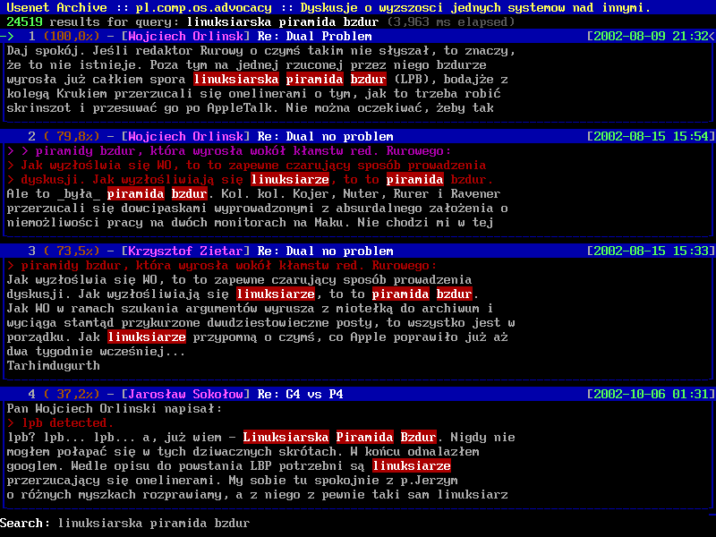
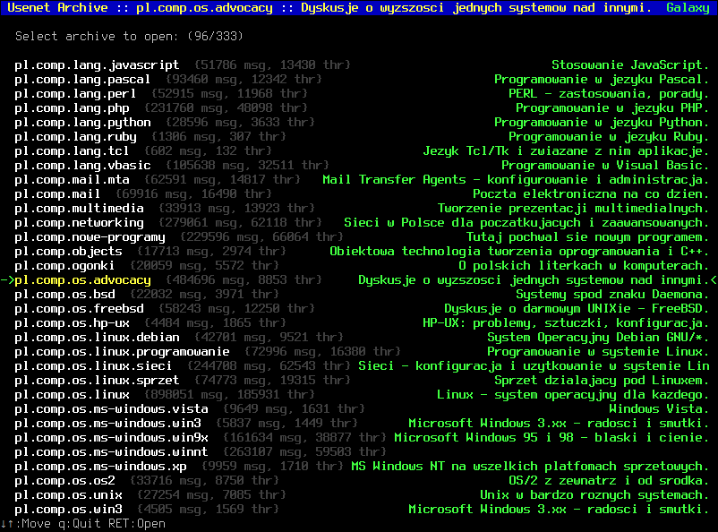
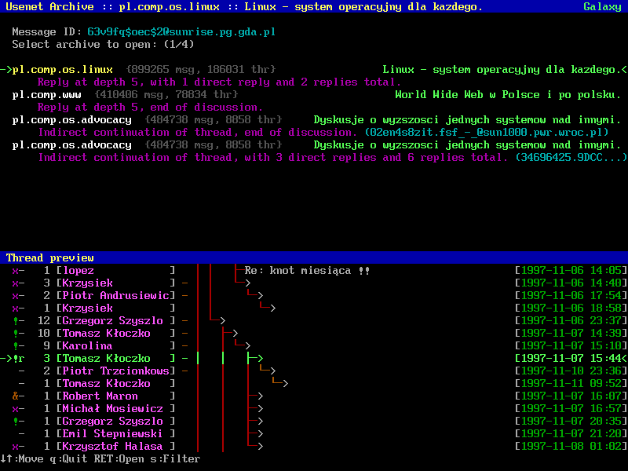
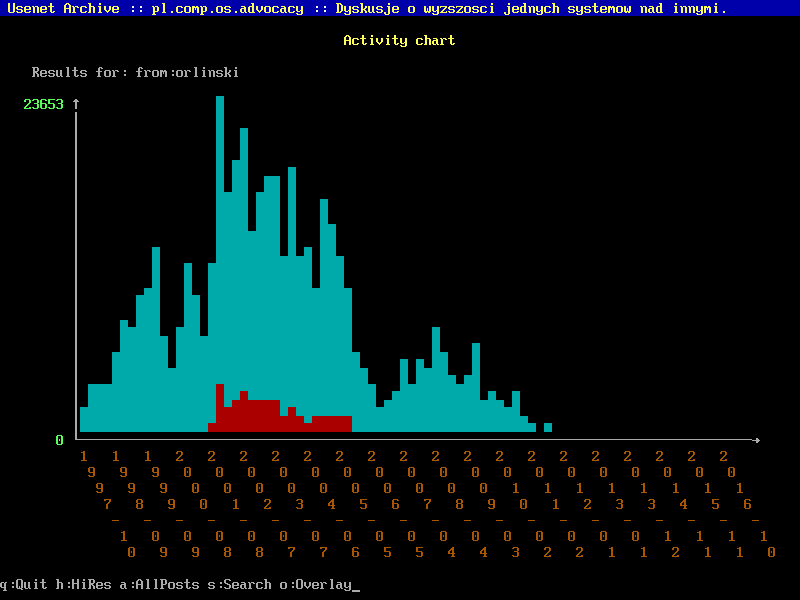

# Usenet Archive Toolkit

The *Usenet Archive Toolkit* project aims to provide a *set of tools* to process various sources of usenet messages into a coherent, searchable archive.

Typically you will have two usage patterns:

1. There is an *already created* archive file that you want to read. To do so, you *only* need to download or build the tbrowser utility.
2. You want to *create* an archive file from the sources available to you. You will need to use most of the provided utilities. Following the workflow graph is a good starting point.

**TL;DR: Download available archive files, use tbrowser to read them.**

## List of UAT archive files

- Archive of polish usenet: [https://archive.org/details/usenet-uat-pl](https://archive.org/details/usenet-uat-pl).
- PC games usenet archive: [https://archive.org/details/usenet-uat-pc-games](https://archive.org/details/usenet-uat-pc-games).

## Motivation

Usenet is dead. You may believe it's not, but it really is.

Polish usenet [message count from 2016.08 to 2016.12](doc/2016.08-to-2016.12.pdf) (approximate).

People went away to various forums, facebooks and twitters and seem fine there. Meanwhile, the old discussions slowly rot away. Google groups is a sad, unusable joke. Archive.org dataset, at least with regard to polish usenet archives, is vastly incomplete. There is no easy way to get the data, browse it, or search it. So, maybe something needs to be done. How hard can it be anyway? (Not very: one month for a working prototype, another one for polish and bugfixing.)

## Advantages

Why use UAT? Why not use existing solutions, like google groups, archives from archive.org or NNTP servers with long history?

- UAT is designed for offline work. You don't need network connection to access data in "the cloud". You don't need to wait for a reply to your query, or, god forbid, endure "web 2.0" interfaces.
- UAT archives won't suddenly disappear. You have them on your disk. Google groups are deteriorating with each new iteration of the interface. Also, google is known for shutting down services they no longer feel viable. Google reader, google code search, google code, etc. Other, smaller services are one disk crash away from completely disappearing from the network.
- UAT archive format is designed for fast access and efficient search. Each message is individually compressed, to facilitate instant access, but uses whole-archive dictionary for better compression. Search is achieved through a database similar in design to google's original paper. Total archive size is smaller than uncompressed collection of messages.
- Multiple message sources may be merged into a single UAT archive, without message duplication. This way you can fill blanks in source A (eg. NNTP archive server) with messages from source B (eg. much smaller archive.org dump). Archives created in such way are *the* most complete collection of messages available.
- UAT archives do not contain duplicate messages (which is common even on NNTP servers), nor stray messages from other groups (archive.org collections contain many bogus messages).
- Other usenet archives are littered with spam messages. UAT can filter out spam, making previously unreadable newsgroups a breeze to read. Properly trained spam database has very low false positive and false negative percentage.
- All messages are transcoded to UTF-8, so that dumb clients may be used for display. UAT tries very hard to properly decode broken and/or completely invalid headers, messages without specified encoding or with bad encoding. HTML parts of message are removed. You also don't need to worry about parsing quoted-printable content (most likely malformed). And don't forget about search. Have fun grepping that base64 encoded message without UAT.
- UAT archives contain precalculated message connectivity graph, which removes the need to parse "references" headers (often broken), sort messages by date, etc. UAT can also "restore" missing connectivity that is not indicated in message headers, through search for quoted text in other messages.
- Access to archives is available through a trivial [libuat interface](libuat/Archive.hpp).
- UAT archives are mapped to memory and 100% disk backed. In high memory pressure situations archive pages may just be purged away and later reloaded on demand. No memory allocations are required during normal libuat operation, other than:
    * Small, static growing buffer used to decompress single message into.
    * std::vectors used during search operation.
- Merits of such approach can be seen in tbrowser, which requires only 10 bytes per message for bookkeeping. Total memory required to display a group with 2.5 million messages is only 25 MB.

## Toolkit description

UAT provides a multitude of utilities, each specialized for its own task. You can find a brief description of each one below.

### Import Formats

Usenet messages may be retrieved from a number of different sources. Currently we support:

- import-source-maildir --- Import from a directory tree where each file is a separate message (e.g. slrnpull produces this with extra-simple setup required to get it working).
- import-source-maildir-7z --- Import from a maildir tree compressed into a single 7z compressed file.
- import-source-mbox --- [Archive.org](https://archive.org/details/usenet) keeps its collection of usenet messages in a mbox format, in which all posts are merged into a single file.
- google-groups --- Crawl google groups and save group in a maildir format.
- nntp-get --- Get messages from NNTP server.

Imported messages are stored in a per-message LZ4 compressed meta+payload database.

### Data Processing

Raw imported messages have to be processed to be of any use. We provide the following utilities:

- extract-msgid --- Extracts unique identifier of each message and builds reference table for fast access to any message through its ID.
- extract-msgmeta --- Extracts "From" and "Subject" fields, as a quick reference for archive browsers.
- merge-raw --- Merges two imported data sets into one. Does not duplicate messages.
- relative-complement --- Extracts messages from the first set, which are not present in the second set.
- utf8ize --- Converts messages to a common character encoding, UTF-8.
- connectivity --- Calculate connectivity graph of messages. Also parses "Date" field, as it's required for chronological sorting.
- threadify --- Some messages do not have connectivity data embedded in headers. Eg. it's a common artifact of using news-email gateways. This tool parses top-level messages, looking for quotations, then it searches other messages for these quotes and creates (not restores! it was never there!) missing connectivity between children and parents.
- repack-zstd --- Builds a common dictionary for all messages and recompresses them to a zstd meta+payload+dict database.
- update-zstd --- Updates already existing zstd archive with new data, without recalculation of dictionary.
- repack-lz4 --- Converts zstd database to LZ4 database.
- package --- Packages all databases into a single file. Supports unpacking.
- sort --- Sort messages in a thread-chronological order.

### Data Filtering

Raw data right after import is highly unfit for direct use. Messages are duplicated, there's spam. These utilities help clean it up:

- kill-duplicates --- Removes duplicate messages. It is relatively rare, but data sets from even a single NNTP server may contain the same message twice.
- filter-newsgroups --- Some data sources (eg. Archive.org's giganews collection) contain messages that were not sent to the collection's newsgroup. This utility will remove such bogus messages.
- filter-spam --- Learns which messages look like spam and removes them.

### Data Search

Search in archive is performed with the help of a word lexicon. The following tools are used for its preparation:

- lexicon --- Build a list of words and hit-tables for each word.
- lexstats --- Display lexicon statistics.
- lexdist --- Calculate distances between words.
- lexsort --- Sort lexicon data.

### Data Access

These tools provide access to archive data:

- query-raw --- Implements queries on LZ4 database. Requires results of extract-msgid utility. Supports:
    * Message count.
    * Listing of message identifiers.
    * Query message by identifier.
    * Query message by database record number.
- libuat --- Archive access library. Operates on zstd database.
- query --- Testbed for libuat. Exposes all provided functionality.
- export-messages --- Unpacks messages contained in a LZ4 archive into separate files.
- verify --- Check archive for known issues.
- galaxy-util --- Generate archive galaxy data.

### End-user Utilities

- tbrowser --- Curses-based text mode browser of archives.

## Future work ideas

Here are some viable ideas that I'm not really planning to do any time soon, but which would be nice to have:

- Implement messages extractor, for example in mbox format. Would need to properly encode headers and add content encoding information (UTF-8 everywhere).
- Implement a read-only NNTP server. Would need to properly encode headers and add content encoding information. 7-bit cleanness probably would be nice, so also encode as quoted-printable. Some headers may need to be rewritten (eg. "Lines", which most probably won't be true, due to MIME processing). Message sorting by date may be necessary to put some sense into internal message numbers, which currently have no meaning at all.
- Implement pan-group search mechanism.

## Workflow

Usenet Archive Toolkit operates on a couple of distinct databases. Each utility requires a specific set of these databases and produces its own database, or creates a completely new database indexing schema, which invalidates rest of databases.

groups.google.com → **google-groups** → produces: maildir tree  
nntp server → **nntp-get** → produces: maildir tree  
maildir directory → **import-source-maildir** → produces: *LZ4*  
maildir compressed → **import-source-maildir-7z** → produces: *LZ4*  
mbox file → **import-source-mbox** → produces: *LZ4*  
*LZ4*, *msgid* → **export-messages** → produces: separate message files  
*LZ4* → **kill-duplicates** → produces: *LZ4*  
*LZ4* → **extract-msgid** → adds: *msgid*  
*LZ4*, *msgid* → **connectivity** → adds: *conn*  
*LZ4*, *conn* → **filter-newsgroups** → produces: *LZ4*  
*LZ4*, *msgid*, *conn*, *str* → **filter-spam** → produces: *LZ4*  
*LZ4* → **extract-msgmeta** → adds: *str*  
(*LZ4*, *msgid*) + (*LZ4*, *msgid*) → **merge-raw** → produces: *LZ4*  
(*LZ4*, *msgid*) + (*LZ4*, *msgid*) → **relative-complement** → produces: *LZ4*  
*LZ4* → **utf8ize** → produces: *LZ4*  
*LZ4* → **repack-zstd** → adds: *zstd*  
*zstd* → **repack-lz4** → adds: *LZ4*  
(*zstd*, *msgid*) + (*LZ4*, *msgid*) → **update-zstd** → produces: *zstd*  
*LZ4*, *conn* → **lexicon** → adds: *lex*  
*lex* → **lexsort** → modifies: *lex*  
*lex* → **lexdist** → adds: *lexdist*  
*lex* → **lexstats** → user interaction  
*LZ4*, *msgid* → **query-raw** → user interaction  
*zstd*, *msgid*, *conn*, *str*, *lex* → **libuat** → user interaction  
*everything but LZ4* → **package** → *one file archive*  
*everything but LZ4* → **threadify** → modifies: *conn*, invalidates: *lex*  
*archive* → **sort** → modifies: *archive*  
*collection of archives* → **galaxy-util** → *archive galaxy*

Additional, optional information files, not created by any of the above utilities, but used in user-facing programs:

- name --- Group name.
- desc\_short --- A short description about the purpose of the group ([per 7.6.6 in RFC 3977](https://tools.ietf.org/html/rfc3977#section-7.6.6)).
- desc\_long --- Group charter. (*Some newsgroups regularly post a description to the group that describes its intention. These descriptions are posted by the people involved with the newsgroup creation and/or administration. If the group has such a description, it almost always includes the word "charter", so you can quickly find it by searching the newsgroup for that word. A charter is the "set of rules and guidelines" which supposedly govern the users of that group.*)
- prefix --- List of *Subject:* header prefixes that should be ignored when determining whether two subjects are the same. One lowercase entry per line.

## Typical Workflow

## Notes

utf8ize doesn't compile on MSVC. Either compile it on cygwin, or have fun banging glib and gmime into submission. Your choice.

UAT only works on 64 bit machines.

## License

    Usenet Archive
    Copyright (C) 2016-2021  Bartosz Taudul <wolf@nereid.pl>

    This program is free software: you can redistribute it and/or modify
    it under the terms of the GNU Affero General Public License as
    published by the Free Software Foundation, either version 3 of the
    License, or (at your option) any later version.

    This program is distributed in the hope that it will be useful,
    but WITHOUT ANY WARRANTY; without even the implied warranty of
    MERCHANTABILITY or FITNESS FOR A PARTICULAR PURPOSE.  See the
    GNU Affero General Public License for more details.

    You should have received a copy of the GNU Affero General Public License
    along with this program.  If not, see <http://www.gnu.org/licenses/>.
